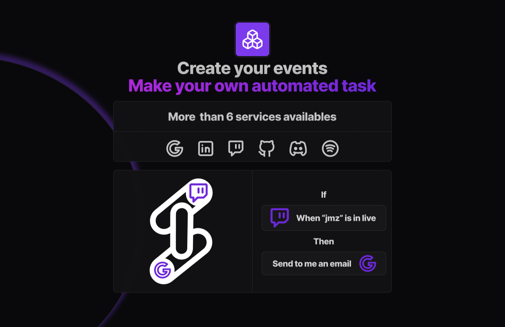
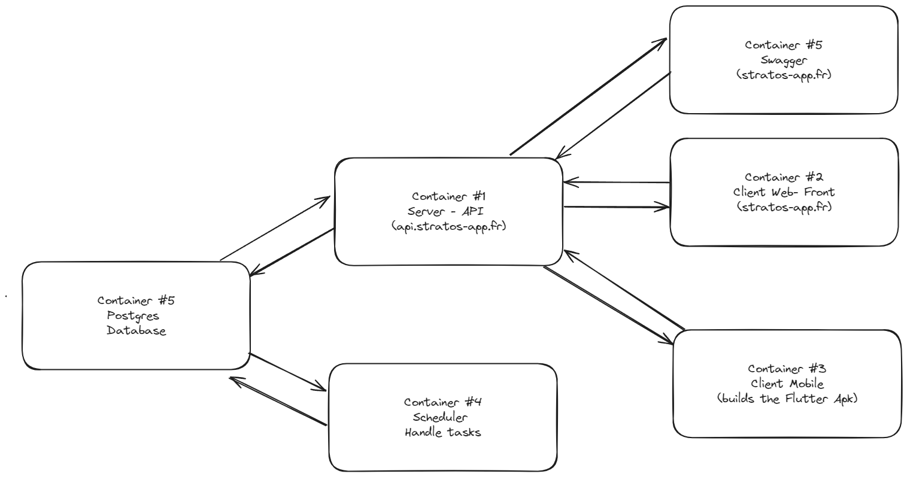

# Area



Application developement project in 3rd year of Epitech. The AREA project is a project that allows you to create automations between different services. For example, you can create an automation that sends you a message on Gmail when you changes your music on Spotify.


## Infrastructure

You can find the full documentation of the infrastructure [here](infrastructure.md)


The AREA project is splitted in 6 differents containers

- **Server** : The server is the main container of the project. It is the one that handles user authentication, the creation of automations, the edition of automations, the deletion of automations, and all of the user data. It is our API that is used by the mobile app and the web app to interact with the database.

- **Web App** : The web app is the front-end of the project. It is used to display the automations, to create them, to edit them, and to delete them. It is also used to display the user data and to edit it.

- **Mobile App** : The mobile app is the front-end of the project. It is used to display the automations, to create them, to edit them, and to delete them. It is also used to display the user data and to edit it.

- **Scheduler** : The scheduler is the container that is used to run the automations. It is the one that will check if the conditions of the automations are met, and if they are, it will run the actions of the automations.

- **Postgres** : The postgres container is the database of the project. It is used to store all the user data, the automations, and the tokens.

- **Swagger** : The swagger container is used to display the API documentation for our end users.

## How to use

### Prerequisites

- Docker
- Docker-compose

You also need to fill in severals .env files in different directories such as:

- backend/.env
- web-app/.env
- mobile/.env
- .env/

All of the .env files have a .env.example file that you can use as a template.

### Run the project

To run the project, you just need to run the following command:

```bash
docker-compose up
```

### Access the project

To access the project, you can go to the following URLs:

- Web App: http://localhost:3000 or http://localhost:8081/
- Mobile App: http://localhost:3000/client.apk or http://localhost:8081/client.apk
- Swagger: http://localhost:4444/
- API: http://localhost:8080/ or http://localhost:3333/

The officials endpoints currently available are:

- https://api.stratos-app.fr
- https://stratos-app.fr


# Front-end

You can find the full documentation of the front-end [here](front.md)

## Setup

In order to start using our project, the `.env` file must be set up! 
Use the `.env.example` file and complete it with the necessary **Client Id**, **Secret** for the services and the **Backend URL**.

Go to web-app folder and install the web dependencies:

```
yarn install
or 
npm install
```
Start the web application:
```
yarn dev
or 
npm run dev
```

## Trigger and Response events

For adding a new trigger or response event, if the new implementation does not need OAuth authorization, it only needs to be done at the backend. However, if an authorization token is needed and it is not already implemented, some modifications need to be made.

## Adding OAuth

For managing the OAuths, we use AuthJS, which already has many built-in services. If the ones you are adding are not on their list, it is possible to create a custom OAuth. 
Everything about it can be found in their documentation: [https://authjs.dev/](https://authjs.dev/)

Steps for adding a new service:
 1. Get the Service **Client Id** and **Secret**, add it to the `.env`
 2. Create a custom AuthJS or add an existing one in the  `route.ts`
 3. In the `SocialAccounts.component.tsx` file, if it is not already there, add the new service to the `socialCards` array

To check if the Service SignIn `button` is added, navigate to the **Settings** page and then click on **Accounts** to check all available OAuths.
