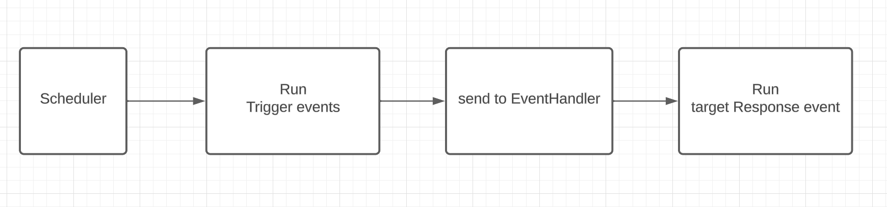

# Backend



## Setup

In order to start using our project, the `.env` file must be set up!
Use the `.env.example` file and complete it with the necessary **Client Id**, **Secret** for the services.

Go to backend folder and install the web dependencies:

```
yarn install
or
npm install
```

To build the project with the docker-compose:

```
docker-compose up --build
```

Start the backend application:
```
yarn dev
or
npm run dev
```

## Swagger

Once the backend has been launched, you can access to the swagger via http://127.0.0.1:3333/docs

## AdonisJS

Stratos backend uses AdonisJS. So you can use directly AdonisJS features.
Basically, the main command is

```
node ace
```

where you can see all commands

You can see the AdonisJS documentation [here](https://docs.adonisjs.com/guides/introduction)

## Add an event

Go to the ```app/``` folder in the root folder.
In params, there are two files, ```responseEvents``` and ```triggerEvents``` where you can see all events in Stratos.

First, you should add an event if it's a response or a trigger, you should precise the provider, the API, if it doesn't already exist.

You can add some fields if you should add some variables in your event, like a username, or a link for example.

Also, you can add some "variables" used in the email event, for example if you want to send the username used as field in the email body.

### Trigger event

If you want to add a trigger event, you should create a scheduler task in ```Tasks/``` folder in the ```app/``` folder.
You can get inspired by the ```Timer``` task to create your task.

The first resources you should get all of events that have your event as trigger event.

Then you should execute your trigger event for all elements.

You can use the ```Cache``` table to store some elements, to add your element you should update the ```Cache``` model in ```Models``` folder and update the migration script.

After this, when you run the scheduler ```node ace scheduler:run``` the backend will execute all trigger events.

### Response event

If you want to add a response event, you should create a new file in ```functions``` folder in ```app``` folder.
The code is very basic but you should just get the OAuth depending on the responseApi stored in the event in the db.

After this, you should add your response event in the EventHandler, in the switch case in a try and catch like those already in existence.

## Route and query

If you want to create a new route, you should update the ```route``` file in the ```start``` folder.

You should add your query in the ```api``` group, and you can create your own group for your root, for example if your queries should be in the path like ```api/group_name/``` so you can create ```group_name``` group.

You can add some middleware, the basic middleware is the auth, where the user must be logged to execute this query.

After this, you can create a Controller file, where you can add your code to execute your query.

For this, I suggest you to see the AdonisJS documentation.
