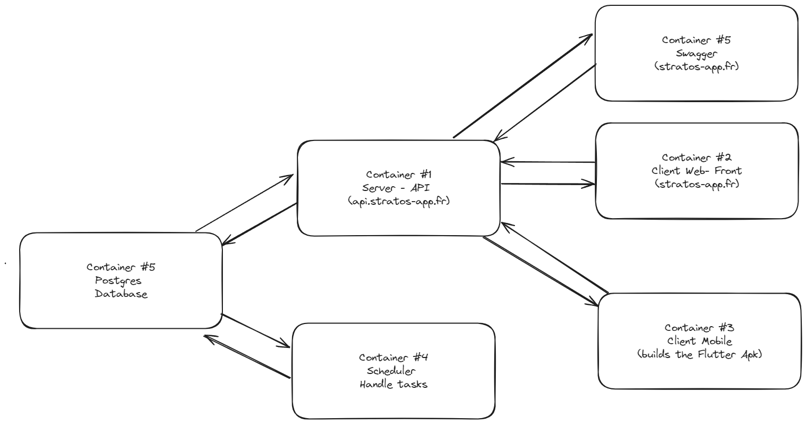

# Infrastructure



The AREA project is splitted in 6 differents containers

- **Server** : The server is the main container of the project. It is the one that handles user authentication, the creation of automations, the edition of automations, the deletion of automations, and all of the user data. It is our API that is used by the mobile app and the web app to interact with the database.

- **Web App** : The web app is the front-end of the project. It is used to display the automations, to create them, to edit them, and to delete them. It is also used to display the user data and to edit it.

- **Mobile App** : The mobile app is the front-end of the project. It is used to display the automations, to create them, to edit them, and to delete them. It is also used to display the user data and to edit it.

- **Scheduler** : The scheduler is the container that is used to run the automations. It is the one that will check if the conditions of the automations are met, and if they are, it will run the actions of the automations.

- **Postgres** : The postgres container is the database of the project. It is used to store all the user data, the automations, and the tokens.

- **Swagger** : The swagger container is used to display the API documentation for our end users.

## How to use

### Prerequisites

- Docker
- Docker-compose

You also need to fill in severals .env files in different directories such as:

- backend/.env
- web-app/.env
- mobile/.env
- .env/

All of the .env files have a .env.example file that you can use as a template.

### Run the project

To run the project, you just need to run the following command:

```bash
docker-compose up
```

### Access the project

To access the project, you can go to the following URLs:

- Web App: http://localhost:3000 or http://localhost:8081/
- Mobile App: http://localhost:3000/client.apk or http://localhost:8081/client.apk
- Swagger: http://localhost:4444/
- API: http://localhost:8080/ or http://localhost:3333/

The officials endpoints currently available are:

- https://api.stratos-app.fr
- https://stratos-app.fr

## Auto-deployment

A script.sh file is available in the root of the project. It is used to deploy the project on a server.

When this script is executed, it will check for new commits on the production branch of the project. If there are new commits, it will pull the new version of the project, and it will rebuild the containers and redeploy the infrastructure.

To add a new cronjob on UNIX system to execute the script.sh file every 5 minutes, you can use the following command:

```bash
crontab -e
```

Then, you can add the following line to the file:

```bash
*/5 * * * * cd /path/to/the/project && bash script.sh
```
